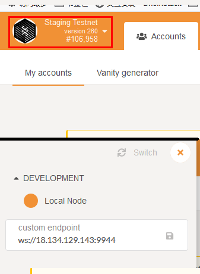
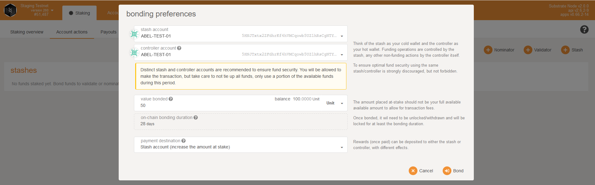
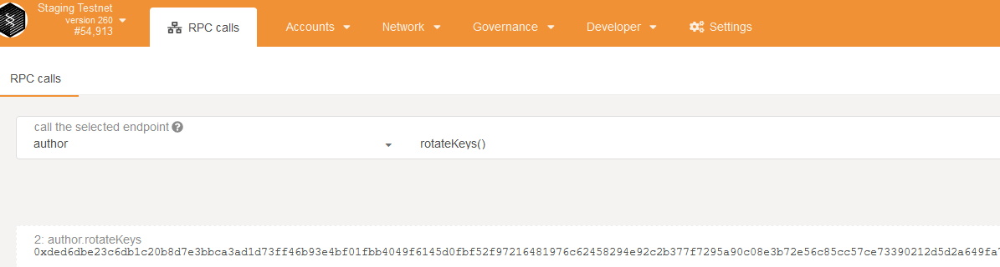
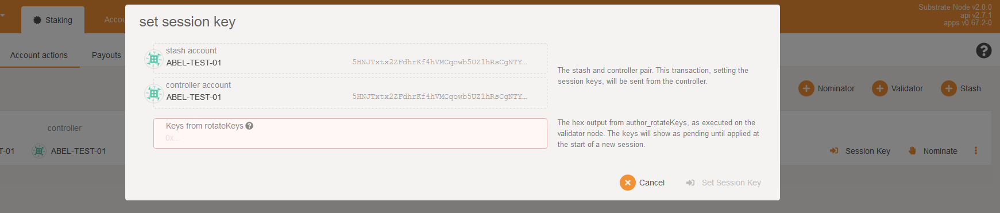
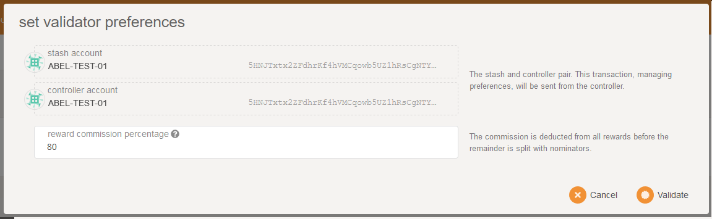
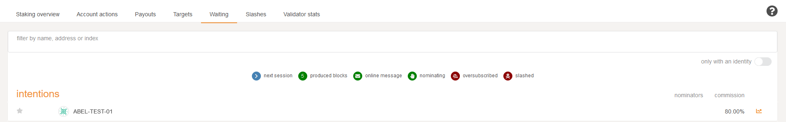

# How to run a validator


## Set Up the Abel-BkChain server node


>NOTE: The recommended configuration for the server node is 1vCPU-2G and the operating system is Ubuntu 18.04 64-bit.

1. Download the [Abel Testnet Node](http://download.jamtpfm.cn/download/abel)
2. Run node of abel. like this:

    other validators can join Abel-Testnet network, just done by specifying the `--bootnodes` parameter as `/ip4/18.134.129.143/tcp/30333/p2p/12D3KooWChw7i3N9SVhZH1DRVdNps8rKwj6u6hGLF1uvTZnp73yC`.


    ```bash
    nohup ./abel  --base-path /home --chain staging   --port 30333   --ws-port 9944  --rpc-port 9933  --validator --name myvalidator  --bootnodes /ip4/18.134.129.143/tcp/30333/p2p/12D3KooWChw7i3N9SVhZH1DRVdNps8rKwj6u6hGLF1uvTZnp73yC --rpc-methods=Unsafe --ws-external   --rpc-external  --rpc-cors all >> /home/bootnode.log 2>&1 &
    ```

    - The optional `--rpc-methods=Unsafe` flag has been added. As the name indicates, this flag is not safe to use in a production setting, but it allows this testnet of abel-bkchain.

    - The optional `--ws-external  --rpc-external` flag has been added. it is allowed to be public, so that other members can access it.


Once the second node is up, you should see them authoring:
```bash
19:38:45  ✌️  version 2.0.0-65f39f4-x86_64-linux-gnu
19:38:45  ❤️  by Abel Technologies abelbeertech@outlook.com, 2017-2020
19:38:45  📋 Chain specification: Staging Testnet
19:38:45  🏷 Node name: myvalidator
19:38:45  👤 Role: AUTHORITY
19:38:45  💾 Database: RocksDb at /data/chain-data/db/myvalidator/chains/staging_testnet/db
19:38:45  ⛓  Native runtime: node-260 (substrate-node-0.tx1.au10)
19:38:46  Using default protocol ID "sup" because none is configured in the chain specs
19:38:46  🏷 Local node identity is: 12D3KooWGkEJC2axeL6esRqPQYzTuXhNmU5MKQKys3ucNK38CQdv
19:38:46  📦 Highest known block at #28787
19:38:46  〽️ Prometheus server started at 127.0.0.1:9615
19:38:46  Listening for new connections on 0.0.0.0:9944.
19:38:46  👶 Starting BABE Authorship worker
19:38:50  🔍 Discovered new external address for our node: /ip4/18.134.129.144/tcp/30333/p2p/12D3KooWGkEJC2axeL6esRqPQYzTuXhNmU5MKQKys3ucNK38CQdv
19:38:51  ⚙️  Syncing, target=#28989 (2 peers), best: #28787 (0x158c…3d36), finalized #28785 (0xa387…2195), ⬇ 1.9kiB/s ⬆ 2.6kiB/s
19:38:56  ⚙️  Syncing  0.0 bps, target=#28991 (4 peers), best: #28787 (0x158c…3d36), finalized #28785 (0xa387…2195), ⬇ 11.6kiB/s ⬆ 3.7kiB/s
19:38:59  ✨ Imported #28992 (0x6fa9…61a5)
19:38:59  ♻️  Reorg on #28992,0x6fa9…61a5 to #28992,0xcafc…284d, common ancestor #28991,0x4255…33d0
19:38:59  ✨ Imported #28992 (0xcafc…284d)
```

> In the firewall configuration allow access to port 9944.


## Switch Your Validator Node On Testnet UI
> NOTE: Use Firefox to do the following. 

Main region: [Testnet UI](http://testnet.abel.beer). 
Asian-Pacific region: [Testnet UI](http://121.196.109.253)

First, we need set Firefox's config. Type `about:config` in the address bar, 
search `network.websocket.allowInsecureFromHTTPS` and change it's value to `true`.


Click on the `Staging Testnet` area in the upper left corner of the webpage, and input the `ws://your ip of node:9944`, then click `Switch` button.




## Create Your Account On Testnet UI. 

On the "Accounts" tab, click "Add account". You do not need to provide a name, although you may if you would like to save this account for submitting transaction in addition to validating.

Generate an sr25519 key which will be used by Aura for block production. Take careful note of the menmonic phrase, and the SS58 address which can be copied by clicking on the identicon in the top left.

Then generate an ed25519 key which will be used by GRANDPA for block finalization. Again, note the menmonic phrase and ss58 address.


## Acquire Abel Testnet Tokens
You'll need some Abel tokens to keep going on testnet. 
There are several ways to acquire tokens:

- send an email containing your account to abelclubservice@gmail.com.
- send us issus on "acquire tokens" topics in [abel-bkchain/issues](https://github.com/abelbeertech/abel-bkchain/issues/new).


## Bond Abel Token
It is highly recommended that you make your controller and stash accounts be two separate accounts. For this, you will create two accounts and make sure each of them have at least enough funds to pay the fees for making transactions. Keep most of your funds in the stash account since it is meant to be the custodian of your staking funds.

Make sure not to bond all your ABEL balance since you will be unable to pay transaction fees from your bonded balance.

It is now time to set up our validator. We will do the following:
- Bond the ABEL of the Stash account. These ABEL will be put at stake for the security of the network and can be slashed.
- Select the Controller. This is the account that will decide when to start or stop validating.

First, go to the Staking section. Click on "Account Actions", and then the "Stash" button.



- Stash account - Select your Stash account. In this example, we will bond 100 ABEL - make sure that your Stash account contains at least this much. You can, of course, stake more than this.
- Controller account - Select the Controller account created earlier. This account will also need a small amount of ABEL in order to start and stop validating.
Value bonded - How much ABEL from the Stash account you want to bond/stake. Note that you do not need to bond all of the ABEL in that account. Also note that you can always bond more ABEL later. However, withdrawing any bonded amount requires the duration of the unbonding period.
- Payment destination - The account where the rewards from validating are sent.


Once everything is filled in properly, click Bond and sign the transaction with your Stash account.

## Set Session Keys
You need to tell the chain your Session keys by signing and submitting an extrinsic. This is what associates your validator node with your Controller account.

You can generate your Session keys in the client via the apps RPC. If you are doing this, make sure that you have the Apps explorer attached to your validator node. You can configure the apps dashboard to connect to the endpoint of your validator in the Settings tab. 

Once ensuring that you have connected to your node, the easiest way to set session keys for your node is by calling the author_rotateKeys RPC request to create new keys in your validator's keystore. Navigate to Toolbox tab and select RPC Calls then select the author > rotateKeys() option and remember to save the output that you get back for a later step.



## Submitting the setKeys Transaction
You need to tell the chain your Session keys by signing and submitting an extrinsic. This is what associates your validator with your Controller account.

Go to Staking > Account Actions, and click "Set Session Key" on the bonding account you generated earlier. Enter the output from author_rotateKeys in the field and click "Set Session Key".



Submit this extrinsic and you are now ready to start validating.


## Validate
To verify that your node is live and synchronized, head to Telemetry and find your node. Note that this will show all nodes on the Polkadot network, which is why it is important to select a unique name!

If everything looks good, go ahead and click on "Validate" in  UI.



- Payment preferences - You can specify the percentage of the rewards that will get paid to you. The remaining will be split among your nominators.

Click "Validate".

If you go to the "Staking" tab, you will see a list of active validators currently running on the network. At the top of the page, it shows the number of validator slots that are available as well as the number of nodes that have signaled their intention to be a validator. You can go to the "Waiting" tab to double check to see whether your node is listed there.


